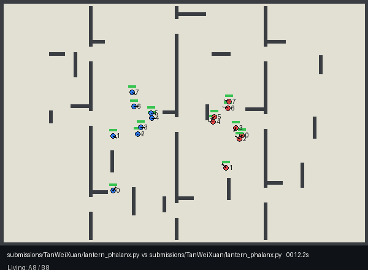

# SwarmBenchV3

SwarmBenchV3 is a deterministic, open-source benchmark and Kaggle-style competition for decentralized multi-agent control and combat. Two teams deploy eight identical units into an unknown arena. Every unit runs an independent instance of the submitted Python controller: there is no omniscient team controller, shared memory, or hidden map access.



*Lantern Phalanx versus Lantern Phalanx, seed 42—the decisive 13-second combat sequence.*

Units explore through local vision, coordinate with one optional 64-bit radio packet per control step, and fight with deterministic hitscan weapons. The authoritative simulator is headless. Versioned replays are produced first, verified by reconstruction, and rendered afterward, so presentation cannot affect match timing or results.

## Game at a glance

| | Rules |
| --- | --- |
| Teams | 8 independently controlled units per side |
| Arena | Unknown, connected 120 m × 80 m occupancy grid with 1 m cells |
| Runtime | 120 simulation seconds; 20 Hz physics and 10 Hz control |
| Movement | 4 m/s maximum speed, 8 m/s² acceleration; movement and facing are independent |
| Vision | 18 m, 120° field of view plus 3 m all-around awareness; walls occlude vision |
| Weapon | 22 m hitscan, 20 damage, 6-round magazine, 0.8 s interval, 2 s reload; friendly fire is enabled |
| Radio | One unsigned 64-bit broadcast, 30 m range, reliable one-step latency, friendly-only |
| Victory | Immediate on elimination; otherwise most surviving units at 120 s; ties are draws |

The [game specification](docs/GAME_SPEC.md) is authoritative for scheduling, geometry, combat, and tie conventions. The [controller API](docs/CONTROLLER_API.md) defines exactly what one unit can observe and do.

## What changed from V2?

V3 is a clean break from the archived [SwarmBenchV2](https://github.com/TanWeiXuan/SwarmBenchV2), not a compatibility layer.

| V2 | V3 |
| --- | --- |
| One perfect-information controller commanded a mixed-class team | Eight isolated controller instances each receive only one unit's local observations |
| Vehicles scored at goals; contacts destroyed units; tanks fired projectiles | Identical health-based units use solid contacts and simultaneous hitscan combat |
| Mirrored 100 m × 60 m obstacle arena | Unknown connected 120 m × 80 m occupancy grid |
| Team-wide state was directly available | Coordination requires an explicit, range-limited 64-bit radio protocol |
| Rendering could fall back to GIF | Verified replays feed an MP4-first renderer with spectator and information-bounded unit views |

V3 retains the strongest operational ideas from V2—deterministic side swaps, Glicko-2 rating periods, fail-closed artifacts, isolated untrusted compute, serialized publication, and permanent tournament Discussions—without importing V2 code, ratings, submissions, or runtime state. See the full [V2-to-V3 migration note](docs/MIGRATION_V2_TO_V3.md).

## Quick start

SwarmBenchV3 targets Python 3.12. Use a dedicated environment:

```bash
python3.12 -m venv .venv
.venv/bin/python -m pip install -e '.[dev,competition,render]'
.venv/bin/python -m pytest
```

Generate an arena, run a match, and render its replay:

```bash
.venv/bin/python -m swarmbench arena --seed 42 --render out/arena.png
.venv/bin/python -m swarmbench match \
  --controller-a rush \
  --controller-b radio_rush \
  --seed 42 \
  --replay out/match.json.gz
.venv/bin/python -m swarmbench render out/match.json.gz --output out/match.mp4
```

Render the same replay from unit A3's information-bounded perspective:

```bash
.venv/bin/python -m swarmbench render out/match.json.gz \
  --output out/unit-A3.mp4 \
  --perspective unit \
  --team A \
  --unit-id 3 \
  --fov
```

The local backend is convenient for development, but it is **not a hostile-code sandbox**. Official validation and tournaments build `Dockerfile.controller` and start sixteen locked-down containers per match—one for each unit.

## Write a controller

A submission is one Python file defining `UnitController`. The file is loaded independently for every unit, so attributes on `self` are private to that unit.

```python
import math

from swarmbench import Action, BaseUnitController, Observation, Team, UnitInfo


class UnitController(BaseUnitController):
    def initialize(self, info: UnitInfo) -> None:
        self.speed = info.rules.max_speed
        self.direction = 1.0 if info.team is Team.A else -1.0

    def step(self, observation: Observation) -> Action:
        enemy = min(
            observation.visible_enemies,
            key=lambda unit: math.dist(observation.self_state.position, unit.position),
            default=None,
        )
        heading = (
            math.atan2(
                enemy.position[1] - observation.self_state.position[1],
                enemy.position[0] - observation.self_state.position[0],
            )
            if enemy is not None
            else (0.0 if self.direction > 0 else math.pi)
        )
        return Action(
            desired_velocity=(self.speed * self.direction, 0.0),
            desired_heading=heading,
            fire=enemy is not None,
            reload=observation.self_state.ammunition == 0,
        )
```

`initialize()` receives immutable rules, team and unit identity, the unit's own starting state, and an independent controller seed. `step()` receives only current local sensing and radio input. Built-in opponents are deliberately simple: `rush`, `spread_rush`, and `radio_rush`.

Validate a controller locally:

```bash
.venv/bin/python -m swarmbench validate submissions/example/controller.py
```

For hostile or unknown code, build the official image and use Docker isolation:

```bash
docker build -t swarmbench-v3-controller -f Dockerfile.controller .
.venv/bin/python -m swarmbench validate submissions/example/controller.py --backend docker
```

## Generate a controller with a coding agent

Replace `<OUTPUT_PATH>` with `submissions/<github-login>/<controller-name>.py` before using this prompt. Identify the agent or model in the controller name or a top-of-file comment.

```text
You are competing in SwarmBenchV3. Inspect the repository to understand the
game rules, per-unit controller API, partial observability, radio semantics,
physics, hitscan combat, deadlines, validation tools, replays, and built-in
baselines. Implement the strongest valid and robust controller you can as one
Python file at `<OUTPUT_PATH>`.

Each of the eight units runs this file in a genuinely independent worker. Use
only information exposed to that unit by the public API. You may validate the
controller, play matches, inspect replays, and iterate, but do not modify any
other repository file, exploit bugs, or violate documented limits. Optimize
for unseen opponents and hidden deterministic seeds rather than known tests.
Clearly attribute non-trivial strategy or code drawn from another controller.
```

## Submit a controller

Open a pull request containing exactly one regular file:

```text
submissions/<github-login>/<controller-name>.py
```

The required workflow checks PR structure, imports and API use, runs a Docker smoke match, and calibrates against every built-in and accepted community controller on both sides across four parallel shards. Opponent versions and ratings are frozen into the artifacts, and the submitted controller is excluded from its own roster. There is no win-rate or aggression threshold: a legal defensive controller may draw or lose calibration games and still be accepted. A trusted reporter binds results to the exact file, commit SHA and opponent snapshot before squash-merging; a separate serialized PR publishes the initial rating.

Read the [submission guide](docs/SUBMISSIONS.md) before opening a PR.

## Community leaderboard

V3 ratings started fresh; no V2 rating or match history was carried over. Only current rating state is committed here. Permanent reports live in [Tournament Results Discussions](https://github.com/TanWeiXuan/SwarmBenchV3/discussions/categories/tournament-results), while selected MP4s, posters, and authoritative replays are published as [per-run media releases](https://github.com/TanWeiXuan/SwarmBenchV3/releases).

<!-- LEADERBOARD_START -->
| Rank | Controller | Author | Rating | RD | W | D | L | Games |
| ---: | --- | --- | ---: | ---: | ---: | ---: | ---: | ---: |
| 1 | Lantern Phalanx | TanWeiXuan | 2307 | 31 | 1123 | 2 | 75 | 1200 |
| 2 | Qwen 3 8 Flash Next Iq3Xxs | TanWeiXuan | 2225 | 37 | 193 | 1 | 30 | 224 |
| 3 | Qwen 3 8 Swift | TanWeiXuan | 2162 | 29 | 947 | 7 | 150 | 1104 |
| 4 | Qwen 3 8 Swift Pincer | TanWeiXuan | 1886 | 29 | 731 | 31 | 366 | 1128 |
| 5 | Radio Rush | SwarmBench | 1545 | 26 | 400 | 141 | 635 | 1176 |
| 6 | Rush | SwarmBench | 1386 | 26 | 188 | 195 | 793 | 1176 |
| 7 | Simple Scout | TanWeiXuan | 1326 | 26 | 154 | 214 | 832 | 1200 |
| 8 | Spread Rush | SwarmBench | 1318 | 26 | 128 | 169 | 879 | 1176 |
<!-- LEADERBOARD_END -->

## Tournaments, replays, and media

The scheduled `Ranking Tournament` workflow freezes controller hashes, versions, pairings, side swaps, and scenario seeds before distributing matches across independent Docker jobs. Every batch self-hashes; aggregation rejects missing, duplicate, stale, or inconsistent results before any rating change. Official Glicko-2 updates are simultaneous from the period's starting ratings. Exhibition runs validate and publish media without changing ratings.

Replays contain the generated arena, validated per-unit actions, physics frames, combat and radio events, observation hashes, and final engine-state hash. Reconstruction replays those actions through a fresh trusted engine without executing controller code. Successful tournament rendering selects at most three matches and publishes MP4, PNG, compressed replay, and manifest assets.

See [tournament design](docs/TOURNAMENTS.md) and [replays and media](docs/REPLAYS_AND_MEDIA.md) for details.

## Reproducibility and security

Scenario identity includes the versioned generator and seed. Engine scheduling and geometry are deterministic, and side-swapped games reuse the same generated scenario. Controller wall-clock timing and arbitrary native behavior are not assumed to be bit-for-bit portable.

Running a community controller through the default local backend executes untrusted Python with the current user's file and credential access. Official Docker workers have no network, a read-only root and controller mount, private IPC and scratch space, dropped capabilities, resource limits, and no repository credentials. Trusted rating, Discussion, and media publishers never execute submission code and consume only validated primitive artifacts.

Read the [security model](docs/SECURITY.md) before running third-party controllers.

## Documentation

| Guide | Contents |
| --- | --- |
| [Game specification](docs/GAME_SPEC.md) | Authoritative rules, timing, sensing, combat, radio, and results |
| [Controller API](docs/CONTROLLER_API.md) | Per-unit observations, actions, deadlines, and failure behavior |
| [Submission guide](docs/SUBMISSIONS.md) | File layout, local validation, calibration, and publication |
| [Tournament design](docs/TOURNAMENTS.md) | Matchmaking, batching, ratings, Discussions, and media releases |
| [Replays and media](docs/REPLAYS_AND_MEDIA.md) | Replay verification, MP4 rendering, and unit perspectives |
| [Security model](docs/SECURITY.md) | Controller isolation and workflow trust boundaries |
| [V2 migration note](docs/MIGRATION_V2_TO_V3.md) | What was retained, adapted, and replaced |
| [Repository setup](docs/REPOSITORY_SETUP.md) | Maintainer configuration for GitHub Actions and the App |

Contributions are welcome; see [CONTRIBUTING.md](CONTRIBUTING.md). SwarmBenchV3 is available under the [MIT License](LICENSE).
